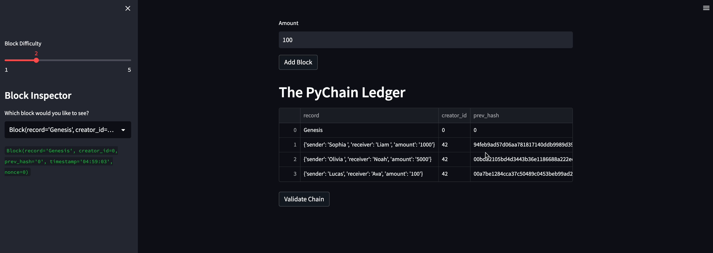

## PyChain Ledger
This repository contains the code for a Python-based blockchain implementation called PyChain Ledger. The PyChain Ledger allows users to store financial transaction records securely and validate the integrity of the blockchain.

### Table of Contents
- [Technologies](#technologies)
- [Installation](#installation)
- [Usage](#usage)
- [Testing the Functionality of the Chain](#testing_the_functionality_of_the_chain)
- [Validating the Blockchain](#validating_the_Blockchain)
- [Contributors](#contributors)
- [License](#license)

### Technologies
This project leverages the following technologies:
* [Python 3.7.13](https://www.python.org/downloads/release/python-385/) - The programming language used in the project.
* [Pandas](https://pandas.pydata.org/) - A Python library used for efficient data manipulation.
* [Visual Studio Code (VS Code)](https://code.visualstudio.com/download) - An integrated development environment (IDE) and source code editor.
* [hashlib](https://docs.python.org/3/library/hashlib.html) - A module providing various hashing algorithms, used for cryptographic operations.
* [datetime](https://docs.python.org/3/library/datetime.html) - A module for manipulating dates and times in Python.

### Installation


1. Clone this repository to your local machine:
```
git clone https://github.com/Xipilscode/PyChain_Ledger-blockchain
```
2. Navigate to the project directory and create a virtual environment:
```
cd alphabet-soup-funding-predictor
python -m venv venv
```
3. Activate the virtual environment:
* Windows:
```
venv\Scripts\activate
```
* macOS/Linux:
```
source venv/bin/activate
```
4. Install the required dependencies:

```
pip install -r requirements.txt
```
### Usage

To use the PyChain Ledger, follow these instructions:

1. Ensure that you have successfully completed the installation steps mentioned above.

2. Run the Streamlit application:
```
streamlit run pychain.py
```
3. The PyChain Ledger interface will open in your default web browser.

4. Enter the required information for each financial transaction, including the `sender`, `receiver`, and `amount`.

5. Click the "Add Block" button to store the transaction in the PyChain Ledger.

6. Verify the block contents and hashes in the dropdown menu displayed on the interface.

### Testing the Functionality of the Chain:


### Validating the Blockchain:




### Contributors

Alexander Likhachev

### License
MIT
